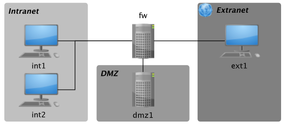

# Practicas SICO - Máster Investigación en Ciberseguridad

## Práctica DMZ - Docker
Se pretende construir una DMZ (utilizando contenedores Docker para simular las máquinas) siguiendo la
topología de red y atendiendo los siguientes criterios:

## Práctica SNORT y Cowrie Honeypot - Docker
### Network IDS - Snort
Instalación y configuración de una sonda Snort version 3.1.0.0. Se desplegará en la máquina fw:
- La máquina fw se usará como sonda de Snort en todas las actividades. Permitirá detectar todo lo que
ocurra, ya que es la máquina encargada de encaminar todo el tráfico.
- Los ataques se llevarán a cabo desde la máquina ext1, que simulará una máquina maliciosa ubicada en
cualquier parte de Internet.
- Como máquina víctima se usará int1, de la red interna.

### Honeypot - Cowrie
Instalación y configuración del honeypot Cowrie. Esta se realizará en la máquina
dmz1 ya que simula un servicio que una organización podría tener expuesto.
